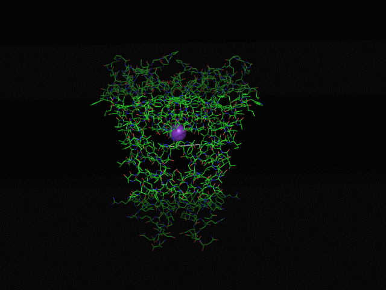

# Membrane Proteins: Moving Metals

This section demonstrates a PyRosetta 4 workflow for membrane-protein modeling:
load a membrane protein, add membrane context, place a metal, and sample nearby
residues through repacking.

## Contents

- [Membrane 1 - Moving Metals.ipynb](Membrane%201%20-%20Moving%20Metals.ipynb):
  the main notebook walkthrough
- [1bl8.nometal.pdb](1bl8.nometal.pdb): input structure
- [1bl8.span](1bl8.span): membrane span file

## Status

This is one of the strongest visual examples in the repository. It is meant to
show the shape of a membrane-protein design workflow and the kinds of animated
outputs that can make those workflows easier to explain.
