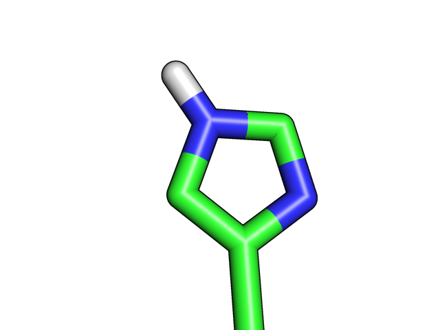
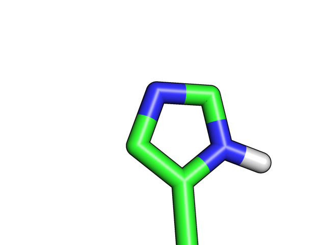

# Prototype Book Chapter

This folder contains an early prototype for a PyRosetta book chapter on writing
protein design algorithms.

The notebook starts with pose setup and score extraction into pandas, then moves
into a restricted packing task and a simple custom algorithm that repeatedly
chooses residues by energy. The goal is not to replace Rosetta's production
design machinery; it is to make the moving parts visible enough that readers can
reason about what the packer is doing.

## Contents

- [Prototype of PyRosetta Jupyter Notebook.ipynb](Prototype%20of%20PyRosetta%20Jupyter%20Notebook.ipynb)
  - Section 1: setting up a pose and extracting energy into a dataframe
  - Section 2: configuring a packer task for selected residues
  - Section 3: writing a simple packing algorithm
  - Section 4: debugging local energy minima
- [1ubq.pdb](1ubq.pdb): input structure used by the chapter prototype
- [his.png](his.png), [his_d.png](his_d.png): histidine tautomer visuals
- [custom4.css](custom4.css): experimental notebook styling

## Visuals

| Histidine | Alternate tautomer |
| --- | --- |
|  |  |

## Status

This is a design and pedagogy prototype. It was written for PyRosetta 4 with an
older Python/Jupyter environment, so treat it as a strong chapter draft rather
than a guaranteed modern install script.
